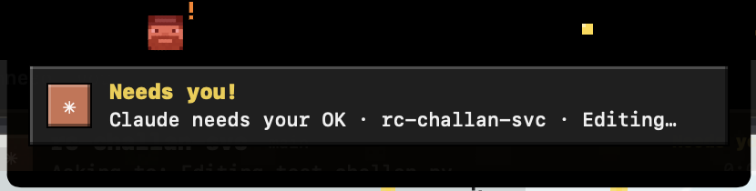
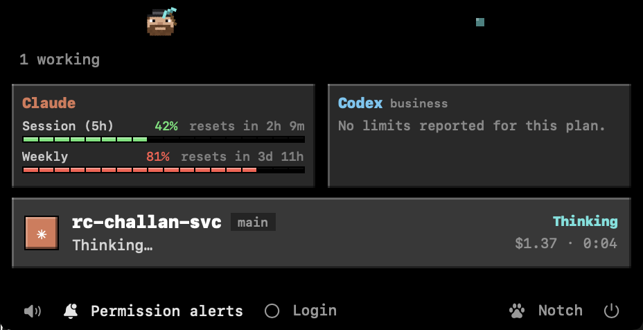
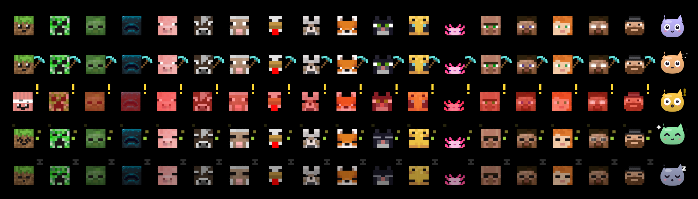
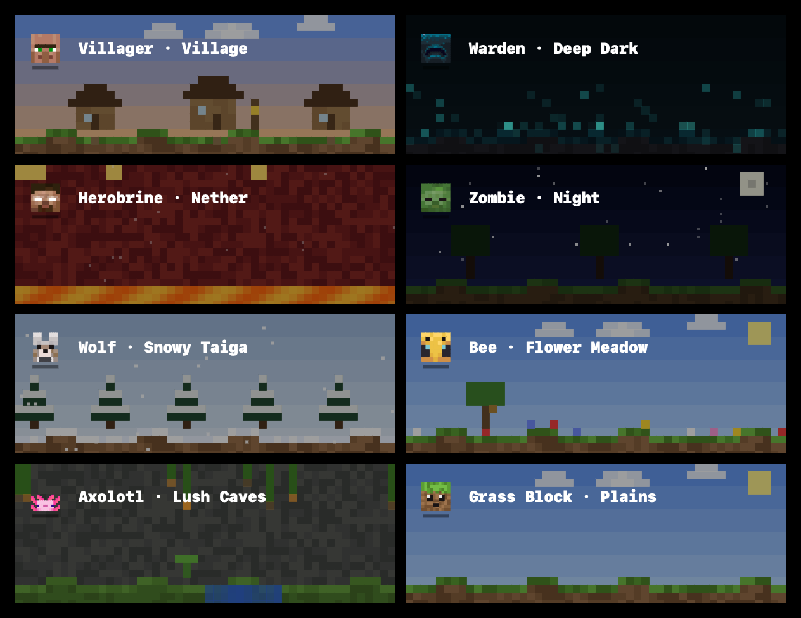

# Notch Pet 🟩

> A tiny blocky buddy that lives in your MacBook notch and babysits your Claude Code and Codex sessions.

Pip sits next to the notch. It mines while your agents work, panics when one needs your OK, celebrates when one finishes, and warns you before you hit your plan limits. The notch is named after the guy who made Minecraft, so Pip is a Minecraft fan. Obviously.



## Install

Needs macOS 14+ and Xcode command line tools (`xcode-select --install`).

```sh
git clone https://github.com/Arpit-Krishna/notch-pet.git
cd notch-pet
./build.sh --run
```

Look at your notch. Hi Pip 👋 To keep it, drag `build/NotchPet.app` into `/Applications` and turn on **Login** in the panel.

Run the tests (52 checks on the log parsers, file tailing and usage resets):

```sh
./test.sh
```

Fun extras:

```sh
build/NotchPet.app/Contents/MacOS/NotchPet --export-pets pets.png      # render the roster
build/NotchPet.app/Contents/MacOS/NotchPet --export-biomes biomes.png  # render the biomes
build/NotchPet.app/Contents/MacOS/NotchPet --export-sounds ./sounds    # every pet's alert sounds as WAV
```

## What Pip does

| When… | Pip… |
|---|---|
| 💤 Nothing is running | sleeps |
| ⛏️ An agent is working | swings a diamond pickaxe |
| ❗ An agent needs your OK | flashes, calls you, gold swirls pour off the notch |
| 🏆 A turn finishes | hops, drops XP orbs, "Advancement made!" |
| 💀 Something errors | goes grey and sheds a tear |
| 📉 75% / 90% of a plan limit | "Running low!" / "Almost out!" |

**Hover the notch** to see every session: what it's doing, context used, cost, and your Claude and Codex limits.
**Click a session or popup** to jump straight to its window.



## Buttons

| Button | What it does |
|---|---|
| 🔔 Permission alerts | Pip knows the moment an agent asks for permission (adds a tiny hook, click again to remove). Codex runs it only after you trust it with `/hooks` in Codex; the bell stays amber until then. |
| 🔗 Connect Claude usage | Shows your Claude 5h and weekly limits, refreshed every 2 minutes. Uses the login saved by the `claude` terminal app (macOS asks once for Keychain access). If that login expires, run `claude` once to renew it. |
| 🐾 Pet picker | Choose your pet |
| 🔊 Mute | Sounds on/off |
| ⭕ Login | Start Pip at login |

🔔 backs up your Claude and Codex settings before changing them. 🔗 changes no settings. Codex limits need no setup.

## Pets and biomes

19 pets, each living in its own biome when you open the panel.




## Sounds

Every pet has its own voice. Have a listen:
[villager](docs/sounds/villager-waiting.wav) · [warden](docs/sounds/warden-waiting.wav) · [zombie](docs/sounds/zombie-error.wav) · [wolf](docs/sounds/wolf-done.wav) · [cat](docs/sounds/cat-select.wav) · [chicken](docs/sounds/chicken-done.wav)

Want the real mob sounds? Run `./fetch-mc-sounds.sh`. They're Mojang's, so they stay on your Mac for personal use and never go in this repo.

---

**Privacy:** watching sessions is fully local, since Pip only reads the logs on your Mac. The one thing that goes online is 🔗 Connect Claude usage: it sends your Claude Code login to Anthropic's API (`api.anthropic.com`) to fetch your usage. Nothing goes anywhere else, Pip never stores the login, and there's no telemetry.

Not affiliated with Mojang or Microsoft. 💚
