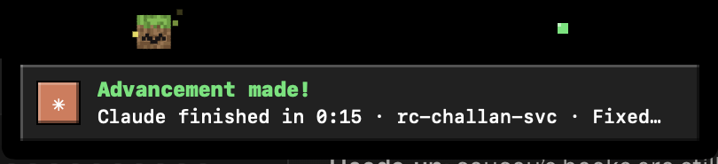

# Notch Pet 🟩

> A tiny blocky buddy that lives in your MacBook notch and babysits your AI agents, so you don't have to.

Your Claude Code and Codex sessions run off doing things in terminals you forgot you opened.
Notch Pet (we call it **Pip**) sits next to the notch and keeps an eye on all of them.
It mines while they work, panics when one needs your permission, celebrates when one finishes, and tells you when you're about to hit your plan limits.

And since the notch is named after the guy who made Minecraft, Pip is a Minecraft fan. Obviously.


---

## What Pip does

| When… | Pip… |
|---|---|
| 💤 Nothing is running | sleeps, with little Zz's floating off its head |
| ⛏️ An agent is working | swings a diamond pickaxe, and the session dots pulse |
| ❗ An agent needs your OK | flashes (the grass block turns into primed TNT 💥), plays its alarm, and gold potion swirls pour off the notch until you answer |
| 🏆 A turn finishes | hops around dropping XP orbs, shows an "Advancement made!" popup, and green Luck swirls linger |
| 💀 Something errors | goes grey, sheds a tear, and red Harming swirls appear |
| 📉 You hit 75% or 90% of a plan limit | pops a "Running low!" / "Almost out!" warning |



Hover over the notch to open the panel:


- **Usage cards** show your Claude and Codex plan limits: session (5h) and weekly, with a bar that fills like an XP bar and time until reset.
- **One row per session** shows project, git branch, what it's doing right now ("Editing client.ts", "Running npm test"), steps taken, context used, cost and turn timer.
- **Too many windows? Click a session (or its popup) and Pip takes you there.** It finds the agent's process and brings its window forward: the exact Terminal or iTerm tab, the VS Code / Cursor / Zed window for that folder, or the Claude / ChatGPT desktop app. The first time, macOS asks whether Pip may control Terminal or iTerm; say OK.
- Right-click a row to open its folder, reveal its transcript, or jump to its window.

## Pick your pet 🐾

19 pets, all hand-drawn pixel art made in code. Here they are in each mood (idle, working, needs you, happy, asleep):


Every Minecraft pet brings its home along. Open the panel and it's painted as that pet's biome:


| Biome | Pets |
|---|---|
| 🏡 Village | Villager, Cat |
| 🌑 Deep Dark (pulsing sculk) | Warden |
| 🔥 Nether (lava sea, glowstone) | Herobrine |
| 🌙 Night (stars, square moon) | Zombie, Creeper |
| ❄️ Snowy Taiga | Wolf, Fox |
| 🌼 Flower Meadow | Bee |
| 🌿 Lush Caves | Axolotl |
| 🌱 Plains | Grass Block, Pig, Cow, Sheep, Chicken, Steve, Alex, Notch |

Want something less blocky? Pick **Classic Pip**, a round little critter with no biome.

## Sounds 🔊

Each pet has its own voice, generated in code. The Villager hums, the Warden's heart thumps, the Zombie groans, the Wolf howls when a turn finishes, the Cat meows. Have a listen:
[villager](docs/sounds/villager-waiting.wav) · [warden](docs/sounds/warden-waiting.wav) · [zombie](docs/sounds/zombie-error.wav) · [wolf](docs/sounds/wolf-done.wav) · [cat](docs/sounds/cat-select.wav) · [chicken](docs/sounds/chicken-done.wav)

Want the real mob sounds instead? Run `./fetch-mc-sounds.sh` (see below).

---

## Install 🛠️

You need macOS 14 or later and Xcode's command line tools (`xcode-select --install`). There are no other dependencies and no Xcode project.

```sh
git clone https://github.com/Arpit-Krishna/notch-pet.git
cd notch-pet
./build.sh --run
```

That builds `build/NotchPet.app` and launches it. Look at your notch. Hi Pip 👋

To keep it around, drag `build/NotchPet.app` into `/Applications`, open it from there, and turn on **Login** in the panel.

> First launch: the app is signed ad hoc on your machine, so macOS may ask you to confirm opening it (right-click → Open).

## The panel buttons

The footer has a few buttons:

| Button | What it does |
|---|---|
| 🖱️ **Click a session or popup** | Jumps to the window running that agent. |
| 🔊 **Mute** | Turns all sounds on or off. |
| 🔔 **Permission alerts** | Off by default. Turn it on and Pip knows *exactly* when Claude or Codex shows a permission prompt, instead of guessing from a tool call that has gone quiet. It adds a tiny hook to `~/.claude/settings.json` and `~/.codex/hooks.json` (with a dated backup of each). The hook only writes down "a prompt is showing" and exits, so your agents behave exactly the same. Click again to remove it. Codex asks you to trust the hook once. |
| ⭕ **Login** | Opens Pip when you log in. |
| 🐾 **Pet picker** | Opens the grid of pets. Click one to switch. It says hello. |
| ⏻ **Quit** | Bye Pip. |

And in the Claude usage card:

| Button | What it does |
|---|---|
| 🔗 **Connect Claude usage** | Claude Code only shares plan limits with its status line, so this sets Pip's status line in `~/.claude/settings.json` (with a backup). Pip's status line saves the numbers, then runs your old status line, so your terminal looks the same. Limits appear after your next message in the Claude Code CLI. The small link icon on the card disconnects it and restores your old status line. |

Codex limits need no setup: Pip reads them from the session logs Codex already writes. Plans without limits (like business plans) say so.

## Real Minecraft sounds (optional, personal use) 🎵

```sh
./fetch-mc-sounds.sh
```

This downloads about 110 short clips from [minecraft.wiki](https://minecraft.wiki) into `~/Library/Application Support/NotchPet/sounds/<pet>/`. Pip then plays a real clip for each alert (Villager "hmm", Wolf howl, Warden heartbeat, Cat purr…) before its jingle. Steve, Alex and Notch use the player sounds (pop, level-up, oof), Herobrine uses spooky cave ambience, and the Grass Block uses dig sounds.

⚠️ Those sounds belong to Mojang. They stay on your Mac, are never committed to this repo, and are for your personal use only. You can also drop your own `.mp3`/`.wav`/`.m4a` files into those folders; files are matched by alert name: `waiting-*`, `done-*`, `error-*`, `select-*`.

---

## How it works (for the curious) 🔍

- **No hooks needed to start.** Pip reads the transcripts both agents already write: `~/.claude/projects/*/*.jsonl` for Claude Code and `~/.codex/sessions/YYYY/MM/DD/rollout-*.jsonl` for Codex. It only reads new bytes, once a second, from files touched in the last 15 minutes.
- **Permission prompts** aren't in transcripts, so without the hook Pip guesses: a tool call quiet for 12 s (45 s for shell commands) shows "may need you". With the hook on, the guessing switches off.
- **Native and light.** Swift + SwiftUI, a borderless panel over the notch, everything (pets, biomes, particles, voices) drawn or synthesized at runtime. No Electron, no web view, no network calls (except the optional sound download).
- **Private.** No telemetry, no accounts. Nothing leaves your Mac.

Handy flags:

```sh
build/NotchPet.app/Contents/MacOS/NotchPet --export-pets pets.png      # render the roster
build/NotchPet.app/Contents/MacOS/NotchPet --export-biomes biomes.png  # render the biomes
build/NotchPet.app/Contents/MacOS/NotchPet --export-sounds ./sounds    # every pet's alert sounds as WAV
```

`NOTCHPET_CLAUDE_ROOT` and `NOTCHPET_CODEX_ROOT` point the watcher at other folders, which is handy for replaying fake sessions.

## Project layout

```
Sources/NotchPet/
  main.swift             app entry + export flags
  NotchController.swift  the panel over the notch, hover, click-through
  NotchViews.swift       collapsed / toast / expanded UI
  SessionStore.swift     finds sessions, tracks state, alerts, effects, usage
  Parsers.swift          Claude Code and Codex transcript parsing
  Usage.swift            plan limits: parsing + usage cards
  Hooks.swift            optional permission hook and status line installers
  WindowJumper.swift     click a session to jump to its terminal / editor window
  PixelPets.swift        pet sprites and the picker
  BlockPetView.swift     the grass block (and its TNT mode)
  PetView.swift          Classic Pip
  Biomes.swift           pixel biomes behind the panel
  PotionEffects.swift    lingering potion swirls
  SoundFX.swift          jingles, synthesized voices, optional clips
```

---

Not affiliated with Mojang or Microsoft. Minecraft is a trademark of Mojang Synergies AB. Pip just really likes it. 💚
